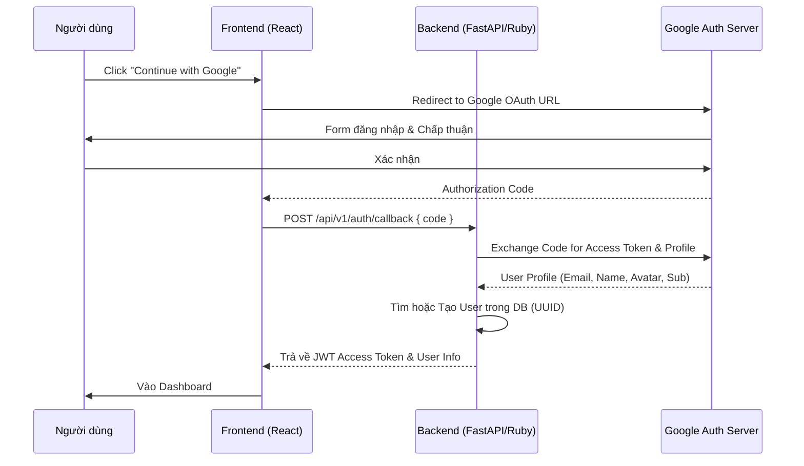

# BE AI TUTOR - Authentication & Authorization

> Chi tiết về Authentication qua Google OAuth 2.0 và Authorization trong hệ thống Document-RAG.

---

## 🔐 Authentication (Google OAuth 2.0 Only)

Hệ thống **CHỈ** sử dụng xác thực thông qua Google. Không có luồng đăng ký/đăng nhập truyền thống bằng Email/Password, không có trang Quên mật khẩu.

### Google Auth Flow



### Authentication Endpoints (v5.1)

1.  **`GET /api/v1/auth/google`**: Trả về URL để redirect sang Google Login.
2.  **`POST /api/v1/auth/callback`**: Nhận code từ FE, thực hiện exchange token và trả về session JWT.
3.  **`GET /api/v1/auth/me`**: Lấy thông tin user hiện tại từ Token.
4.  **`POST /api/v1/auth/logout`**: Thu hồi token/session.

---

## 👥 Authorization (2 Roles: Admin + User)

Hệ thống phân quyền dựa trên Role và Quyền sở hữu Tài liệu (Document Ownership).

### Roles

| Role | Code | Description |
|------|------|-------------|
| User | `user` | Người dùng mặc định: Upload tài liệu, học tập, chat AI |
| Admin | `admin` | Quản trị viên: Giám sát hệ thống, quản lý người dùng & tài liệu lỗi |

### Permission Matrix (Document-RAG)

| Resource | Public | User | Admin |
|----------|--------|------|-------|
| Landing Page | ✅ | ✅ | ✅ |
| Upload Document | - | ✅ | ✅ |
| View Document | - | Owner | ✅ |
| Delete Document | - | Owner | ✅ |
| Generate Quiz/Flashcard | - | Owner | ✅ |
| AI Chat (Document Context) | - | Owner | ✅ |
| AI Chat (General) | - | ✅ | ✅ |
| List Users | - | - | ✅ |
| System Stats | - | - | ✅ |
| Audit Logs | - | - | ✅ |

---

## 🛡️ Implementation Details (UUID Based)

### 1. Token Payload (JWT)
```json
{
  "sub": "uuid-user-1234",
  "email": "user@gmail.com",
  "role": "user",
  "iat": 1713130000,
  "exp": 1713216400
}
```

### 2. Authorization Guards (Pseudocode)

```python
# Dependency: get_current_user
async def get_current_user(token: str = Depends(oauth2_scheme)):
    payload = decode_jwt(token)
    user = await user_repo.find_by_id(payload["sub"])
    return user

# Ownership Guard
async def validate_document_access(doc_id: str, user: User):
    doc = await doc_repo.find_by_id(doc_id)
    if doc.owner_id != user.id and user.role != 'admin':
        raise ForbiddenError("Bạn không có quyền truy cập tài liệu này")
```

---

## 📝 Error Responses (v5.1)

| Status | Code | Mô tả |
|--------|------|-------------|
| 401 | `UNAUTHORIZED` | Token không hợp lệ hoặc đã hết hạn |
| 403 | `FORBIDDEN` | Không có quyền truy cập (Role/Ownership) |
| 404 | `NOT_FOUND` | Tài nguyên không tồn tại |
| 429 | `RATE_LIMIT_EXCEEDED` | Quá giới hạn yêu cầu (đặc biệt là AI Chat) |

---

*Version: 5.1 - Updated: 2026-03-01*
*Strict Google-only Authentication.*
