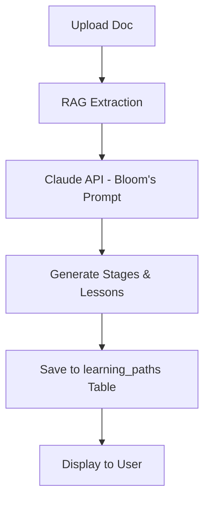
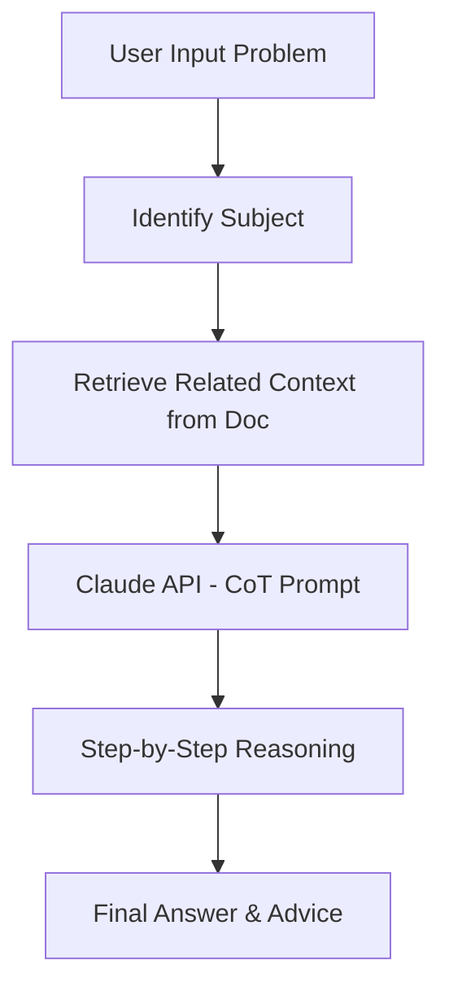

# BE AI TUTOR - AI Services Flow (Document-RAG Based)

> Chi tiết tích hợp AI Services với RAG (Retrieval-Augmented Generation) trên Document

---

## 🤖 AI Services Overview

### RAG Architecture

```
┌─────────────────────────────────────────────────────────────────────────────────┐
│                         RAG (Retrieval-Augmented Generation)                     │
├─────────────────────────────────────────────────────────────────────────────────┤
│                                                                                 │
│  ┌─────────────────────────────────────────────────────────────────────────┐   │
│  │                     DOCUMENT INGESTION PIPELINE                          │   │
│  │                                                                          │   │
│  │   PDF/DOCX ──▶ Extract Text ──▶ Chunk Split ──▶ Embedding ──▶ ChromaDB  │   │
│  │                                                                          │   │
│  └─────────────────────────────────────────────────────────────────────────┘   │
│                                    │                                           │
│                                    ▼                                           │
│  ┌─────────────────────────────────────────────────────────────────────────┐   │
│  │                          RETRIEVAL PIPELINE                              │   │
│  │                                                                          │   │
│  │   User Query ──▶ Embed Query ──▶ Semantic Search ──▶ Retrieved Chunks   │   │
│  │                                                                          │   │
│  └─────────────────────────────────────────────────────────────────────────┘   │
│                                    │                                           │
│                                    ▼                                           │
│  ┌─────────────────────────────────────────────────────────────────────────┐   │
│  │                         GENERATION PIPELINE                              │   │
│  │                                                                          │   │
│  │   Retrieved Chunks + User Query ──▶ Claude API ──▶ Response             │   │
│  │                                                                          │   │
│  └─────────────────────────────────────────────────────────────────────────┘   │
│                                                                                 │
└─────────────────────────────────────────────────────────────────────────────────┘
```

### AI Provider Configuration

```
┌─────────────────────────────────────────────────────────────────┐
│                       AI PROVIDER                               │
├─────────────────────────────────────────────────────────────────┤
│                                                                 │
│  Primary: Claude API (Anthropic)                               │
│  ├── Model: claude-sonnet-4-6-20250514                         │
│  ├── Context: 200K tokens                                      │
│  └── Best for: Educational content, tutoring                   │
│                                                                 │
│  Fallback: Claude Haiku 3.5                                    │
│  ├── Model: claude-3-5-haiku                                   │
│  ├── Context: 200K tokens                                      │
│  └── Best for: Simple tasks, cost optimization                 │
│                                                                 │
└─────────────────────────────────────────────────────────────────┘
```

### Tech Stack for RAG

```
┌─────────────────────────────────────────────────────────────────┐
│                       RAG TECH STACK                            │
├─────────────────────────────────────────────────────────────────┤
│                                                                 │
│  LLM Provider:                                                  │
│  ├── Claude API (Anthropic) - Primary                          │
│  └── Context window: 200K tokens                                │
│                                                                 │
│  AI Framework:                                                  │
│  └── LangChain - Orchestration, prompt templates               │
│                                                                 │
│  Vector Database:                                               │
│  └── ChromaDB - Persistent vector storage                      │
│                                                                 │
│  Embedding Model:                                               │
│  └── sentence-transformers (all-MiniLM-L6-v2)                  │
│      ├── Dimension: 384                                         │
│      └── Fast & efficient for semantic search                   │
│                                                                 │
│  Document Processing:                                           │
│  ├── PyPDF2 - PDF extraction                                   │
│  ├── python-docx - DOCX extraction                             │
│  └── LangChain TextSplitters - Chunking                        │
│                                                                 │
└─────────────────────────────────────────────────────────────────┘
```

### AI Services List (Document-Based)

| Service | Endpoint | Mô tả |
|---------|----------|-------|
| Chat AI | POST /api/v1/chat/messages | Hỏi đáp với AI về tài liệu |
| Generate Quiz | POST /api/v1/ai/generate-quiz | AI tạo quiz từ document |
| Summarize | POST /api/v1/ai/summarize | AI tóm tắt nội dung document |
| Generate Flashcards | POST /api/v1/ai/generate-flashcards | AI tạo flashcard từ document |
| Generate Learning Path | POST /api/v1/ai/generate-learning-path | AI tạo lộ trình học tập |
| Solve Homework | POST /api/v1/ai/solve-homework | AI giải bài tập chi tiết |
| Generate Test Matrix | POST /api/v1/ai/generate-test-matrix | AI sinh ma trận đề thi |

---

## 📚 RAG Pipeline Architecture

### Document Ingestion Flow

```
┌─────────────────────────────────────────────────────────────────────────────┐
│                    DOCUMENT INGESTION ARCHITECTURE                           │
└─────────────────────────────────────────────────────────────────────────────┘

┌──────────┐    ┌──────────┐    ┌──────────┐    ┌──────────┐    ┌──────────┐
│  Upload  │───▶│  Extract │───▶│  Chunk   │───▶│  Embed   │───▶│  Store   │
│ Document │    │   Text   │    │  Split   │    │  Model   │    │ ChromaDB │
└──────────┘    └──────────┘    └──────────┘    └──────────┘    └──────────┘
     │               │               │               │               │
     ▼               ▼               ▼               ▼               ▼
┌──────────┐    ┌──────────┐    ┌──────────┐    ┌──────────┐    ┌──────────┐
│PDF/DOCX  │    │Raw text  │    │Chunks of │    │384-dim   │    │Vector    │
│File      │    │content   │    │~500 chars│    │vectors   │    │Index     │
└──────────┘    └──────────┘    └──────────┘    └──────────┘    └──────────┘
```

### Document Ingestion Process

```python
# app/services/rag_service.py (THAM KẢO)
from langchain.text_splitter import RecursiveCharacterTextSplitter
from langchain_community.embeddings import HuggingFaceEmbeddings
from langchain_community.vectorstores import Chroma
from chromadb import Client
from chromadb.config import Settings

class RAGService:
    def __init__(self):
        # Initialize embedding model
        self.embedding_model = HuggingFaceEmbeddings(
            model_name="sentence-transformers/all-MiniLM-L6-v2"
        )

        # Initialize ChromaDB client
        self.chroma_client = Client(Settings(
            chroma_db_impl="duckdb+parquet",
            persist_directory="./chroma_db"
        ))

        # Text splitter for chunking
        self.text_splitter = RecursiveCharacterTextSplitter(
            chunk_size=500,
            chunk_overlap=50,
            length_function=len,
            separators=["\n\n", "\n", ". ", " ", ""]
        )

    async def ingest_document(self, document_id: int, content: str, metadata: dict):
        """
        Ingest document into vector database.

        Steps:
        1. Split content into chunks
        2. Generate embeddings for each chunk
        3. Store in ChromaDB with metadata
        """
        # Split text into chunks
        chunks = self.text_splitter.split_text(content)

        # Create metadata for each chunk
        chunk_metadata = [
            {
                "document_id": document_id,
                "chunk_index": i,
                **metadata
            }
            for i in range(len(chunks))
        ]

        # Get or create collection
        collection = self.chroma_client.get_or_create_collection(
            name=f"document_{document_id}"
        )

        # Generate embeddings and store
        embeddings = self.embedding_model.embed_documents(chunks)

        collection.add(
            documents=chunks,
            embeddings=embeddings,
            metadatas=chunk_metadata,
            ids=[f"doc_{document_id}_chunk_{i}" for i in range(len(chunks))]
        )

        return {
            "document_id": document_id,
            "chunks_created": len(chunks)
        }

    async def retrieve_relevant_chunks(
        self,
        document_id: int,
        query: str,
        top_k: int = 5
    ) -> list[dict]:
        """
        Retrieve most relevant chunks for a query.

        Steps:
        1. Embed the query
        2. Perform semantic search
        3. Return top-k results
        """
        collection = self.chroma_client.get_collection(
            name=f"document_{document_id}"
        )

        # Embed query
        query_embedding = self.embedding_model.embed_query(query)

        # Search
        results = collection.query(
            query_embeddings=[query_embedding],
            n_results=top_k
        )

        return [
            {
                "content": doc,
                "metadata": meta,
                "distance": dist
            }
            for doc, meta, dist in zip(
                results["documents"][0],
                results["metadatas"][0],
                results["distances"][0]
            )
        ]

    async def get_document_content(self, document_id: int) -> str:
        """Get full document content by retrieving all chunks."""
        collection = self.chroma_client.get_collection(
            name=f"document_{document_id}"
        )

        results = collection.get()

        # Sort by chunk_index and join
        sorted_chunks = sorted(
            zip(results["documents"], results["metadatas"]),
            key=lambda x: x[1].get("chunk_index", 0)
        )

        return "\n\n".join([chunk for chunk, _ in sorted_chunks])
```

---

## 💬 Chat AI Flow (Document-RAG Based)

### Architecture

```
┌─────────────────────────────────────────────────────────────────────────────┐
│                    CHAT ARCHITECTURE (RAG-BASED)                             │
└─────────────────────────────────────────────────────────────────────────────┘

  ┌───────────┐      ┌───────────┐      ┌───────────┐      ┌───────────┐
  │  Client   │─────▶│   API     │─────▶│    RAG    │─────▶│ Claude API│
  │  Request  │      │  Layer    │      │  Service  │      │           │
  └───────────┘      └───────────┘      └───────────┘      └───────────┘
                            │                   │                 │
                            ▼                   ▼                 │
                     ┌───────────┐      ┌───────────┐            │
                     │   Redis   │      │ ChromaDB  │            │
                     │   Cache   │      │  Vectors  │◀───────────┘
                     └───────────┘      └───────────┘
```

### Chat Flow with RAG

```
┌─────────┐     ┌─────────┐     ┌─────────┐     ┌─────────┐     ┌─────────┐
│  User   │────▶│ Retrieve│────▶│  Build  │────▶│  Call   │────▶│  Save   │
│ Message │     │ Context │     │ Prompt  │     │   AI    │     │Response │
│  + Doc  │     │ (RAG)   │     │         │     │         │     │         │
└─────────┘     └─────────┘     └─────────┘     └─────────┘     └─────────┘
                    │
                    ▼
            ┌───────────────┐
            │ 1. Embed Query│
            │ 2. Semantic   │
            │    Search     │
            │ 3. Get Top-K  │
            │    Chunks     │
            └───────────────┘
```

### Chat RAG Flow Detail

```python
# app/services/chat_service.py (THAM KẢO)
from app.services.rag_service import RAGService
from app.services.ai_service import AIService

class ChatService:
    def __init__(
        self,
        rag_service: RAGService,
        ai_service: AIService
    ):
        self.rag_service = rag_service
        self.ai_service = ai_service

    async def process_message(
        self,
        conversation_id: int,
        message: str,
        document_id: int | None = None
    ) -> dict:
        """
        Process chat message with RAG context retrieval.

        Flow:
        1. Get conversation history
        2. If document_id provided, retrieve relevant chunks
        3. Build prompt with context
        4. Call Claude API
        5. Save response
        """
        # Step 1: Retrieve relevant context if document is specified
        context = ""
        if document_id:
            chunks = await self.rag_service.retrieve_relevant_chunks(
                document_id=document_id,
                query=message,
                top_k=5
            )
            context = "\n\n".join([
                f"[Context {i+1}]: {chunk['content']}"
                for i, chunk in enumerate(chunks)
            ])

        # Step 2: Build system prompt with document context
        system_prompt = self._build_system_prompt(document_id is not None)

        # Step 3: Build user prompt
        if context:
            user_prompt = f"""Dựa vào nội dung tài liệu sau để trả lời câu hỏi:

TÀI LIỆU THAM KHẢO:
{context}

CÂU HỎI: {message}"""
        else:
            user_prompt = message

        # Step 4: Call AI
        response, tokens_used = await self.ai_service._call_api(
            prompt=user_prompt,
            system=system_prompt
        )

        return {
            "response": response,
            "tokens_used": tokens_used,
            "context_used": bool(context)
        }

    def _build_system_prompt(self, has_document: bool) -> str:
        if has_document:
            return """Bạn là AI Tutor thông minh, giúp học viên hiểu nội dung tài liệu.

HƯỚNG DẪN:
1. Trả lời dựa trên nội dung tài liệu được cung cấp
2. Nếu thông tin không có trong tài liệu, hãy nói rõ
3. Giải thích rõ ràng, dễ hiểu
4. Sử dụng ví dụ từ tài liệu khi phù hợp
5. Khuyến khích học viên đặt câu hỏi sâu hơn

PHONG CÁCH:
- Thân thiện, động viên
- Trình bày có cấu trúc
- Sử dụng markdown khi cần"""
        else:
            return """Bạn là AI Tutor thông minh và thân thiện.

HƯỚNG DẪN:
1. Hỗ trợ học viên với câu hỏi chung
2. Đề xuất tài liệu hoặc chủ đề liên quan
3. Giải thích rõ ràng, dễ hiểu"""
```

### System Prompt Template (Document-Based)

```
Bạn là AI Tutor thông minh, giúp học viên học tập hiệu quả từ tài liệu.

THÔNG TIN TÀI LIỆU:
- Tên: {document_title}
- Loại: {document_type}
- Chủ đề: {topics}

NỘI DUNG THAM KHẢO (từ RAG):
{retrieved_chunks}

HƯỚNG DẪN:
1. Trả lời dựa trên nội dung tài liệu
2. Nếu thông tin không có trong tài liệu, hãy nói rõ
3. Giải thích rõ ràng với ví dụ từ tài liệu
4. Đề xuất các phần liên quan để đọc thêm
5. Khuyến khích tư duy phản biện

PHONG CÁCH:
- Thân thiện, động viên
- Sử dụng markdown format
- Trích dẫn nguồn khi cần
```

---

## 📝 AI Generate Quiz Flow (Document-RAG Based)

### Flow

```
┌─────────────┐     ┌─────────────┐     ┌─────────────┐     ┌─────────────┐
│ Select      │────▶│ RAG         │────▶│ Call        │────▶│ Save        │
│ Document    │     │ Retrieve    │     │ Claude API  │     │ Quiz to DB  │
│             │     │ Content     │     │             │     │             │
└─────────────┘     └─────────────┘     └─────────────┘     └─────────────┘
                           │
                           ▼
                   ┌───────────────┐
                   │ Get Document  │
                   │ Chunks from   │
                   │ ChromaDB      │
                   └───────────────┘
```

### Prompt Template (Document-Based)

```
Nhiệm vụ: Tạo quiz từ nội dung tài liệu sau.

NỘI DUNG TÀI LIỆU (từ RAG):
{document_content}

YÊU CẦU:
- Số câu hỏi: {num_questions}
- Độ khó: {difficulty} (easy/medium/hard)
- Loại câu hỏi: trắc nghiệm 1 đáp án
- Mỗi câu có 4 lựa chọn (A, B, C, D)
- Câu hỏi phải dựa trên nội dung tài liệu

ĐỊNH DẠNG OUTPUT (JSON):
{
  "title": "Quiz: {document_title}",
  "questions": [
    {
      "content": "Câu hỏi?",
      "explanation": "Giải thích đáp án",
      "points": 1,
      "answers": [
        {"content": "Đáp án A", "is_correct": true},
        {"content": "Đáp án B", "is_correct": false},
        {"content": "Đáp án C", "is_correct": false},
        {"content": "Đáp án D", "is_correct": false}
      ]
    }
  ]
}
```

### Request/Response

**Request:**
```json
{
  "document_id": 1,
  "num_questions": 5,
  "difficulty": "medium",
  "question_types": ["multiple_choice"]
}
```

**Response:**
```json
{
  "generation_id": 1,
  "quiz": {
    "title": "AI Generated Quiz: Python Tutorial",
    "description": "Quiz được tạo tự động từ nội dung tài liệu",
    "questions": [
      {
        "content": "Python được tạo ra bởi ai?",
        "explanation": "Guido van Rossum tạo ra Python năm 1991",
        "points": 1,
        "answers": [
          {"content": "Guido van Rossum", "is_correct": true},
          {"content": "Dennis Ritchie", "is_correct": false},
          {"content": "James Gosling", "is_correct": false},
          {"content": "Bjarne Stroustrup", "is_correct": false}
        ]
      }
    ]
  },
  "tokens_used": 1500,
  "created_at": "2026-03-01T10:00:00Z"
}
```

### Code Implementation

```python
# app/services/ai_service.py (THAM KẢO)
async def generate_quiz(
    self,
    document_id: int,
    num_questions: int = 5,
    difficulty: str = "medium",
    user_id: int = None
) -> dict:
    """Generate quiz questions from document content using RAG."""

    # Get document content from RAG
    document_content = await self.rag_service.get_document_content(document_id)

    system = """You are an expert quiz creator. Create educational quiz questions that test understanding of the material.
Always respond with valid JSON only, no additional text."""

    prompt = f"""Create a {difficulty} quiz with {num_questions} multiple choice questions based on the following document content.

DOCUMENT CONTENT:
{document_content}

Requirements:
- Each question must have exactly 4 answers
- Exactly one answer must be correct
- Include explanation for each question
- Questions should test understanding, not just memorization

Respond in this JSON format:
{{
  "title": "Quiz title",
  "questions": [
    {{
      "content": "Question text",
      "explanation": "Why this answer is correct",
      "points": 1,
      "answers": [
        {{"content": "Answer A", "is_correct": false}},
        {{"content": "Answer B", "is_correct": true}},
        {{"content": "Answer C", "is_correct": false}},
        {{"content": "Answer D", "is_correct": false}}
      ]
    }}
  ]
}}"""

    response_text, tokens_used = await self._call_api(prompt, system)
    result = json.loads(response_text)

    if user_id and document_id:
        result["generation_id"] = await self._save_generation(
            user_id, "quiz", document_id, tokens_used, result
        )

    result["tokens_used"] = tokens_used
    return result
```

---

## 📄 AI Summarize Flow (Document-RAG Based)

### Flow

```
┌─────────────┐     ┌─────────────┐     ┌─────────────┐     ┌─────────────┐
│ Select      │────▶│ RAG         │────▶│ Call        │────▶│ Save        │
│ Document    │     │ Retrieve    │     │ Claude API  │     │ Summary     │
│             │     │ Content     │     │             │     │             │
└─────────────┘     └─────────────┘     └─────────────┘     └─────────────┘
```

### Prompt Template (Document-Based)

```
Nhiệm vụ: Tóm tắt nội dung tài liệu sau.

NỘI DUNG TÀI LIỆU (từ RAG):
{document_content}

YÊU CẦU:
- Độ dài tối đa: {max_length} ký tự
- Phong cách: {style} (paragraph/bullet_points/outline)
- Trình bày các ý chính
- Giữ lại từ khóa quan trọng
- Dựa trên nội dung thực tế của tài liệu

ĐỊNH DẠNG OUTPUT:
- paragraph: Một đoạn văn ngắn gọn
- bullet_points: Các gạch đầu dòng
- outline: Cấu trúc phân cấp
```

### Request/Response

**Request:**
```json
{
  "document_id": 1,
  "max_length": 500,
  "style": "bullet_points"
}
```

**Response:**
```json
{
  "summary_id": 1,
  "document_id": 1,
  "summary": "• Python là ngôn ngữ lập trình bậc cao\n• Được tạo bởi Guido van Rossum năm 1991\n• Cú pháp rõ ràng, dễ học\n• Hỗ trợ nhiều paradigm: OOP, functional, procedural",
  "style": "bullet_points",
  "tokens_used": 450,
  "created_at": "2026-03-01T10:00:00Z"
}
```

### Code Implementation

```python
# app/services/ai_service.py (THAM KHẢO)
async def summarize(
    self,
    document_id: int,
    max_length: int = 500,
    style: str = "paragraph",
    user_id: int = None
) -> dict:
    """Generate summary of document content using RAG."""

    # Get document content from RAG
    content = await self.rag_service.get_document_content(document_id)

    style_instructions = {
        "paragraph": "Write a concise paragraph summary.",
        "bullet_points": "Write bullet points summarizing key ideas.",
        "outline": "Create a hierarchical outline with main points and sub-points."
    }

    prompt = f"""Summarize the following content in {style_instructions.get(style, style_instructions['paragraph'])}

Maximum length: {max_length} characters

CONTENT:
{content}

Provide only the summary, no additional commentary."""

    response_text, tokens_used = await self._call_api(prompt)

    result = {
        "summary": response_text[:max_length],
        "style": style
    }

    if user_id and document_id:
        result["summary_id"] = await self._save_generation(
            user_id, "summary", document_id, tokens_used, result
        )

    result["tokens_used"] = tokens_used
    return result
```

---

## 🎴 AI Generate Flashcards Flow (Document-RAG Based)

### Flow

```
┌─────────────┐     ┌─────────────┐     ┌─────────────┐     ┌─────────────┐
│ Select      │────▶│ RAG         │────▶│ Call        │────▶│ Save        │
│ Document    │     │ Retrieve    │     │ Claude API  │     │ Flashcards  │
│             │     │ Key Parts   │     │             │     │ to DB       │
└─────────────┘     └─────────────┘     └─────────────┘     └─────────────┘
```

### Prompt Template (Document-Based)

```
Nhiệm vụ: Tạo flashcard từ nội dung tài liệu.

NỘI DUNG TÀI LIỆU (từ RAG):
{document_content}

YÊU CẦU:
- Số flashcard: {num_cards}
- Front: Câu hỏi/thuật ngữ (ngắn gọn)
- Back: Câu trả lời/định nghĩa (ngắn gọn, < 100 từ)
- Tập trung vào các khái niệm quan trọng trong tài liệu
{focus_instruction}

ĐỊNH DẠNG OUTPUT (JSON):
{
  "flashcards": [
    {
      "front": "Variable là gì?",
      "back": "Variable là nơi lưu trữ dữ liệu với một tên định danh.",
      "hint": "Không cần khai báo kiểu dữ liệu"
    },
    {
      "front": "print() function",
      "back": "Hàm dùng để hiển thị output ra màn hình."
    }
  ]
}
```

### Request/Response

**Request:**
```json
{
  "document_id": 1,
  "num_cards": 10,
  "focus_topics": ["variables", "functions"]
}
```

**Response:**
```json
{
  "generation_id": 1,
  "flashcards": [
    {
      "front": "Làm thế nào để khai báo biến trong Python?",
      "back": "Sử dụng cú pháp: variable_name = value\nVí dụ: name = 'Python'",
      "hint": "Không cần khai báo kiểu dữ liệu"
    },
    {
      "front": "Hàm trong Python được định nghĩa bằng từ khóa nào?",
      "back": "def\nVí dụ: def my_function():",
      "hint": "Viết tắt của 'define'"
    }
  ],
  "tokens_used": 1200,
  "created_at": "2026-03-01T10:00:00Z"
}
```

### Code Implementation

```python
# app/services/ai_service.py (THAM KHẢO)
async def generate_flashcards(
    self,
    document_id: int,
    num_cards: int = 10,
    focus_topics: list = None,
    user_id: int = None
) -> dict:
    """Generate flashcards from document content using RAG."""

    # Get document content from RAG
    content = await self.rag_service.get_document_content(document_id)

    focus_instruction = ""
    if focus_topics:
        focus_instruction = f"\nFocus on these topics: {', '.join(focus_topics)}"

    system = "You are an expert educator creating effective flashcards for learning."

    prompt = f"""Create {num_cards} flashcards from the following content.
Each flashcard should:
- Have a clear question/prompt on the front
- Have a concise answer on the back
- Include an optional hint if helpful{focus_instruction}

CONTENT:
{content}

Respond in this JSON format:
{{
  "flashcards": [
    {{
      "front": "Question or prompt",
      "back": "Answer or explanation",
      "hint": "Optional hint"
    }}
  ]
}}"""

    response_text, tokens_used = await self._call_api(prompt, system)
    result = json.loads(response_text)

    if user_id and document_id:
        result["generation_id"] = await self._save_generation(
            user_id, "flashcard", document_id, tokens_used, result
        )

    result["tokens_used"] = tokens_used
    return result
```

---

## 🔄 Complete AI Service Flow Diagram

```
┌─────────────────────────────────────────────────────────────────────────────────┐
│                      AI SERVICES COMPLETE FLOW (DOCUMENT-RAG)                   │
└─────────────────────────────────────────────────────────────────────────────────┘

                              ┌──────────────┐
                              │    Client    │
                              │   Request    │
                              └──────┬───────┘
                                     │
                                     ▼
                    ┌────────────────────────────────┐
                    │         API Gateway            │
                    │   (FastAPI Endpoint)           │
                    └────────────────┬───────────────┘
                                     │
              ┌──────────────────────┼──────────────────────┐
              │                      │                      │
              ▼                      ▼                      ▼
     ┌────────────────┐    ┌────────────────┐    ┌────────────────┐
     │  Generate Quiz │    │   Summarize    │    │   Flashcards   │
     │   Endpoint     │    │   Endpoint     │    │   Endpoint     │
     └───────┬────────┘    └───────┬────────┘    └───────┬────────┘
             │                     │                     │
             └──────────────────────┼─────────────────────┘
                                    │
                                    ▼
                    ┌────────────────────────────────┐
                    │        AI Service              │
                    │  (Business Logic Layer)        │
                    └────────────────┬───────────────┘
                                     │
                    ┌────────────────┼────────────────┐
                    │                │                │
                    ▼                ▼                ▼
           ┌──────────────┐  ┌──────────────┐  ┌──────────────┐
           │ RAG Service  │  │ Claude API   │  │  Repository  │
           │ (Retrieval)  │  │ (Generation) │  │   (Storage)  │
           └──────┬───────┘  └──────────────┘  └──────────────┘
                  │
                  ▼
           ┌──────────────┐
           │  ChromaDB    │
           │ (Vectors)    │
           └──────────────┘
```

---

## ⚡ Performance Optimization

### Caching Strategy

```
┌─────────────────────────────────────────────────────────────────┐
│                       CACHING RULES                             │
├─────────────────────────────────────────────────────────────────┤
│                                                                 │
│  1. RAG Context Cache                                          │
│     ├── Key: rag_context:{document_id}:{query_hash}            │
│     ├── TTL: 1 hour                                            │
│     └── Purpose: Cache retrieved chunks                        │
│                                                                 │
│  2. Document Embeddings Cache                                  │
│     ├── Key: doc_embeddings:{document_id}                      │
│     ├── TTL: 24 hours                                          │
│     └── Purpose: Cache document embeddings                     │
│                                                                 │
│  3. Summary Cache                                              │
│     ├── Key: summary:{document_id}:{style}:{length}            │
│     ├── TTL: 7 days                                            │
│     └── Purpose: Cache summaries                               │
│                                                                 │
│  4. Quiz Cache                                                 │
│     ├── Key: quiz:{document_id}:{difficulty}:{num_questions}   │
│     ├── TTL: 24 hours                                          │
│     └── Purpose: Cache generated quizzes                       │
│                                                                 │
│  5. Rate Limit Counter                                         │
│     ├── Key: rate_limit:{user_id}:{service}                    │
│     ├── TTL: 1 hour                                            │
│     └── Purpose: Track API usage                               │
│                                                                 │
└─────────────────────────────────────────────────────────────────┘
```

### RAG Optimization

```python
# RAG Performance Tips

# 1. Chunk Size Optimization
CHUNK_SIZE = 500      # Optimal for most documents
CHUNK_OVERLAP = 50    # Preserve context between chunks

# 2. Retrieval Optimization
TOP_K_CHUNKS = 5      # Balance between context and tokens
SIMILARITY_THRESHOLD = 0.7  # Filter low-relevance chunks

# 3. Embedding Batch Processing
BATCH_SIZE = 100      # Process embeddings in batches

# 4. Vector Database Indexing
# Use IVF (Inverted File Index) for large datasets
# Use HNSW for fast approximate search
```

### Response Streaming (Chat only)

```python
async def stream_response(message: str, document_id: int):
    """Stream chat response with RAG context."""
    # Retrieve context
    chunks = await rag_service.retrieve_relevant_chunks(
        document_id=document_id,
        query=message,
        top_k=5
    )

    context = "\n\n".join([c["content"] for c in chunks])

    # Stream response
    async for chunk in claude_client.messages.stream(
        model="claude-sonnet-4-6-20250514",
        messages=[{
            "role": "user",
            "content": f"Context: {context}\n\nQuestion: {message}"
        }],
        system=build_system_prompt()
    ):
        yield chunk.delta.text
```

---

## 🛡️ Rate Limiting

### Limits per Service

| Service | Free/Hour | Free/Day | Premium/Hour | Premium/Day |
|---------|-----------|----------|--------------|-------------|
| Chat AI | 20 | 100 | 100 | 500 |
| Generate Quiz | 5 | 20 | 20 | 100 |
| Summarize | 10 | 50 | 50 | 200 |
| Generate Flashcards | 5 | 20 | 20 | 100 |

---

## 🔧 Error Handling

### Common Errors

| Error | Code | Action |
|-------|------|--------|
| API Timeout | 504 | Retry with exponential backoff |
| Rate Limited | 429 | Return cached or queue |
| Invalid Response | 500 | Re-prompt with clearer instructions |
| Document Not Found | 404 | Return error message |
| RAG Retrieval Failed | 500 | Fall back to direct content |
| Content Too Long | 400 | Use chunked retrieval |

### Fallback Strategy

```
Primary (Claude Sonnet) ──▶ Error ──▶ Fallback (Claude Haiku) ──▶ Error
                                                                  │
                                                                  ▼
                                                          Cached Response
                                                                  │
                                                                  ▼
                                                           Generic Message
```

### Error Handling Code

```python
async def generate_quiz_with_fallback(self, document_id: int, **kwargs) -> dict:
    """Generate quiz with fallback strategy."""
    try:
        # Try primary model
        return await self.generate_quiz(document_id, **kwargs)
    except RateLimitError:
        # Wait and retry
        await asyncio.sleep(60)
        return await self.generate_quiz(document_id, **kwargs)
    except APIError as e:
        # Log error and return error response
        logger.error(f"AI API Error: {e}")
        return {
            "error": "Unable to generate quiz",
            "message": "Please try again later"
        }
    except RAGError as e:
        # Fallback to direct document content
        logger.warning(f"RAG Error, using fallback: {e}")
        content = await self.get_direct_content(document_id)
        return await self.generate_quiz_from_content(content, **kwargs)
```

---

## 💰 Cost Optimization

### Token Management

```
┌─────────────────────────────────────────────────────────────────┐
│                     TOKEN OPTIMIZATION                          │
├─────────────────────────────────────────────────────────────────┤
│                                                                 │
│  1. Use Cheaper Models When Possible                           │
│     ├── Simple Q&A → Claude Haiku                              │
│     ├── Generate Flashcards → Claude Haiku                     │
│     └── Complex quiz generation → Claude Sonnet                │
│                                                                 │
│  2. Optimize RAG Retrieval                                     │
│     ├── Limit top_k to 3-5 chunks                              │
│     ├── Filter by similarity threshold                         │
│     └── Cache frequent queries                                 │
│                                                                 │
│  3. Chunk Size Optimization                                    │
│     ├── Smaller chunks = more precise retrieval                │
│     └── Larger chunks = more context per chunk                 │
│                                                                 │
│  4. Cache Common Responses                                     │
│     └── Reduce API calls for similar queries                   │
│                                                                 │
│  5. Batch Operations                                           │
│     └── Generate multiple items in 1 call                      │
│                                                                 │
└─────────────────────────────────────────────────────────────────┘
```

---

## 📊 Monitoring

### Metrics to Track

```
┌─────────────────────────────────────────────────────────────────┐
│                       AI METRICS                                │
├─────────────────────────────────────────────────────────────────┤
│                                                                 │
│  Usage Metrics:                                                 │
│  ├── Total calls per service per day                           │
│  ├── Calls per user                                            │
│  ├── Peak usage hours                                          │
│  └── Token usage per request                                   │
│                                                                 │
│  RAG Metrics:                                                   │
│  ├── Retrieval latency                                         │
│  ├── Chunk relevance scores                                    │
│  ├── Cache hit rate (embeddings)                               │
│  └── Document ingestion time                                   │
│                                                                 │
│  Performance Metrics:                                           │
│  ├── Response time (p50, p95, p99)                             │
│  ├── Cache hit rate                                            │
│  └── Error rate                                                │
│                                                                 │
│  Quality Metrics:                                               │
│  ├── User feedback (thumbs up/down)                            │
│  ├── Quiz/Flashcard acceptance rate                            │
│  └── Summary relevance score                                   │
│                                                                 │
└─────────────────────────────────────────────────────────────────┘
```

---

## 🗄️ Database Schema

```sql
-- ai_generations table (unified)
CREATE TABLE ai_generations (
    id SERIAL PRIMARY KEY,
    user_id INTEGER NOT NULL REFERENCES users(id),
    document_id INTEGER NOT NULL REFERENCES documents(id),
    type VARCHAR(20) NOT NULL CHECK (type IN ('quiz', 'summary', 'flashcard')),
    tokens_used INTEGER NOT NULL,
    result JSONB NOT NULL,
    created_at TIMESTAMP NOT NULL DEFAULT NOW()
);

-- Indexes
CREATE INDEX idx_ai_generations_user ON ai_generations(user_id);
CREATE INDEX idx_ai_generations_document ON ai_generations(document_id);
CREATE INDEX idx_ai_generations_type ON ai_generations(type);
CREATE INDEX idx_ai_generations_created ON ai_generations(created_at DESC);
```

---

## 📋 API Endpoints Summary

| Method | Endpoint | Mô tả |
|--------|----------|-------|
| POST | `/api/v1/ai/generate-quiz` | Tạo quiz từ document |
| POST | `/api/v1/ai/summarize` | Tóm tắt document |
| POST | `/api/v1/ai/generate-flashcards` | Tạo flashcard từ document |
| GET | `/api/v1/ai/summaries` | Danh sách summaries |
| GET | `/api/v1/ai/summaries/{id}` | Chi tiết summary |
| GET | `/api/v1/ai/generations` | Lịch sử AI generations |

---

*Tài liệu này định nghĩa tích hợp AI Services với RAG cho hệ thống.*
*Version: 3.0 - Document-RAG Based: Chat, Generate Quiz, Summarize, Generate Flashcards*
*Updated: 2026-03-01*
---

## 🗺️ AI Generate Learning Path Flow

### Concept: Bloom's Taxonomy Implementation
AI phân tích tài liệu để chia thành các giai đoạn:
1. **Remember & Understand**: Các khái niệm nền tảng.
2. **Apply & Analyze**: Vận dụng kiến thức giải quyết vấn đề.
3. **Evaluate & Create**: Tổng hợp và đánh giá chuyên sâu.

### Flow


---

## 🧠 Homework Solver Flow (Chain-of-Thought)

### Flow


### Prompt Snippet
> "Dựa trên tài liệu [CONTEXT], hãy giải bài tập [PROBLEM]. Sử dụng kỹ thuật Chain-of-Thought để giải thích từng bước logic."

---

## 📊 Test Matrix Generation Flow

### Flow
1. User chọn tài liệu.
2. AI phân tích độ phủ kiến thức trong tài liệu.
3. AI gợi ý ma trận: 
   - Chủ đề A: 3 câu dễ, 2 câu khó.
   - Chủ đề B: 5 câu trung bình.
4. User xác nhận ma trận.
5. AI sinh đề trắc nghiệm khớp 100% ma trận đã định.

---

*Version: 5.0 - Tài liệu AI Integration nâng cao.*
